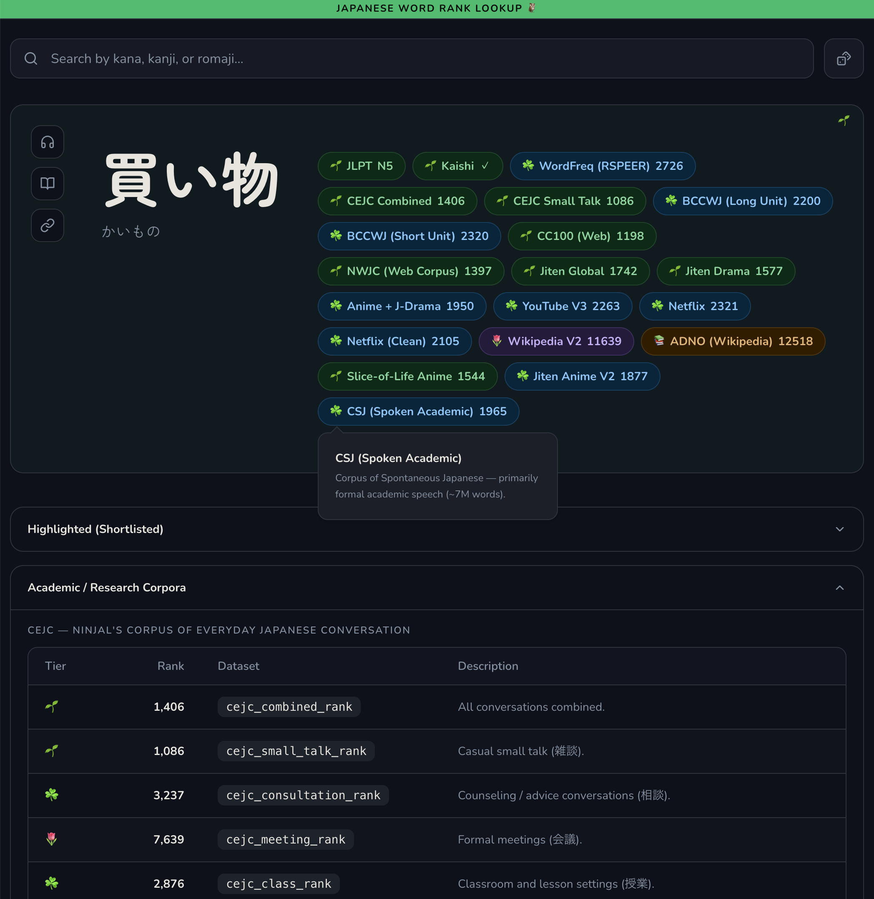
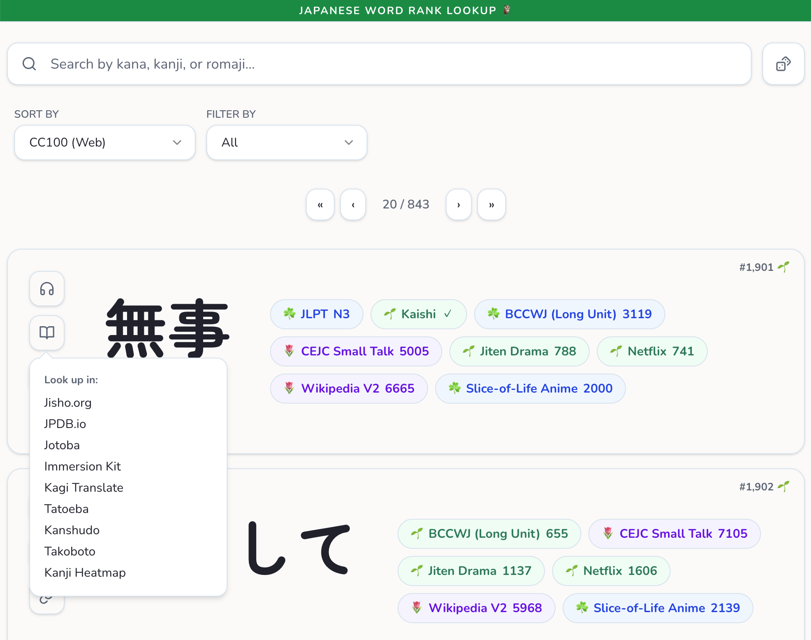
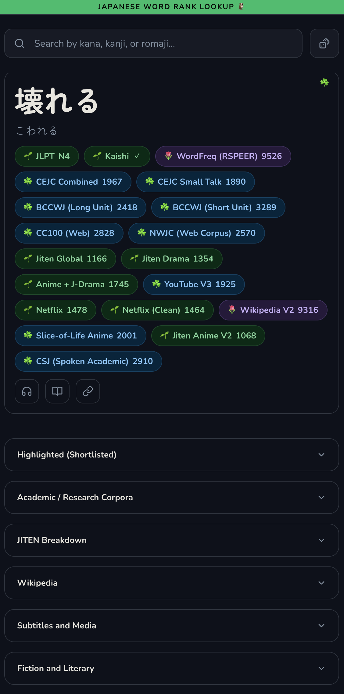

# Japanese Word Rank Lookup

See how often a Japanese word appears in everyday conversations, Netflix, YouTube, Wikipedia, and more.
A free, fully static website for looking up Japanese word frequency rankings across multiple datasets. Search by kana, kanji, or romaji to see how common a word is across different corpora.

## Screenshots





## Features

- Browse 80,000+ Japanese words sorted by various frequency rankings
- View detailed frequency data across 75+ datasets for each word
- Search by kana, kanji, or romaji with typeahead
- 20 sort orders (JLPT, various frequency lists, Kaishi deck, etc.)
- Filter by katakana-only or non-katakana words
- JLPT level (N5–N1) and Kaishi 1500 badges
- Light and dark theme

## Tech Stack

- [Astro](https://astro.build/) v6 (static site generation)
- [Tailwind CSS](https://tailwindcss.com/) v4
- Vanilla JS (no frontend framework)

## Getting Started

```bash
pnpm install
pnpm run dev
```

## Scripts

| Command               | Description                                                   |
| --------------------- | ------------------------------------------------------------- |
| `pnpm run dev`        | Start the Astro dev server                                    |
| `pnpm run build:data` | Generate JSON API files from CSV/JSON source data             |
| `pnpm run build`      | Run `build:data` then `astro build` for full production build |
| `pnpm run preview`    | Preview the production build locally                          |

## How It Works

Source data (CSV, JSON, TXT) in `data/` is processed at build time into ~110k static JSON files in `public/api/`. The site ships as two HTML pages that fetch this JSON on demand:

- **Home (`/`)** — Paginated word list with sort and filter controls
- **Word detail (`/word/?w=...`)** — All frequency rankings for a single word

## Data Sources

Frequency data is consolidated from [PikaPikaGems/japanese-word-frequency](https://github.com/PikaPikaGems/japanese-word-frequency). Primary sources include:

- [learnjapanese.moe — Recommended Frequency Dictionaries](https://learnjapanese.moe/yomichan/#recommended-frequency-dictionaries)
- [jiten.moe](https://jiten.moe/other)
- [Kuuuube/yomitan-dictionaries](https://github.com/Kuuuube/yomitan-dictionaries)
- [MarvNC/yomitan-dictionaries](https://github.com/MarvNC/yomitan-dictionaries)
- [IlyaSemenov/wikipedia-word-frequency](https://github.com/IlyaSemenov/wikipedia-word-frequency)
- [adno/wikipedia-word-frequency-clean](https://github.com/adno/wikipedia-word-frequency-clean)
- [hermitdave/FrequencyWords](https://github.com/hermitdave/FrequencyWords)
- [chriskempson/japanese-subtitles-word-kanji-frequency-lists](https://github.com/chriskempson/japanese-subtitles-word-kanji-frequency-lists)
- [rspeer/wordfreq](https://github.com/rspeer/wordfreq)
- [Maltesaa/CSJ_and_NWJC_yomitan_freq_dict](https://github.com/Maltesaa/CSJ_and_NWJC_yomitan_freq_dict)
- [hingston/japanese](https://github.com/hingston/japanese)
- [hlorenzi/jisho-open/](https://github.com/hlorenzi/jisho-open/)

JLPT data from [tanos.co.uk/jlpt](https://www.tanos.co.uk/jlpt/). Kaishi deck data from [donkuri/kaishi](https://github.com/donkuri/kaishi).

## Disclaimer

Data quality, coverage, and methodology vary across sources. No guarantees are made about accuracy, completeness, or fitness for any particular purpose. See the Terms of Use page for details.

## License

Built by [PikaPikaGems](https://github.com/PikaPikaGems).
